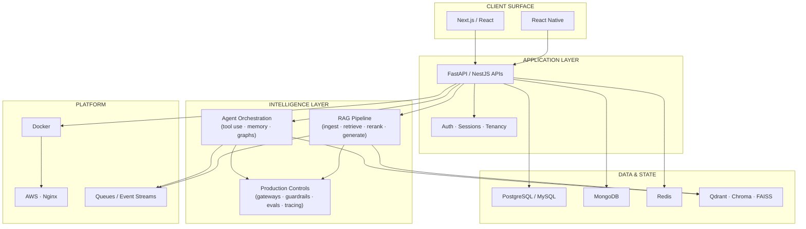

<!--
  Mirza Shahbaz Ali Baig — GitHub Profile README (Engineering Edition)
  File: github_profile_README_v2.md
  Paste into: https://github.com/shahbaz957/shahbaz957/README.md
-->

<a id="top"></a>

<div align="center">


<br/>

```text
 ┌──────────────────────────────────────────────────────────────────────┐
 │  ROLE     Full Stack AI Engineer                                     │
 │  DOMAIN   Agentic AI · Advanced RAG · System Design · Product Eng    │
 │  STYLE    Architecture-first · Production-minded · Measurement-driven│
 │  NORTH    Ship intelligence that survives production constraints     │
 └──────────────────────────────────────────────────────────────────────┘
```

[](https://www.shahbazbaig.xyz)
[](https://www.linkedin.com/in/mirza-shahbaz-ali-baig-3391b3248)
[](mailto:mirzashahbazbaig724@gmail.com)
[](https://leetcode.com/u/shahbaz957/)


</div>

---

<details open>
<summary><b>▣ NAVIGATION</b></summary>

<br/>

| Jump | Section |
|:----:|:--------|
| `01` | [System Identity](#01-system-identity) |
| `02` | [Architecture Map](#02-architecture-map) |
| `03` | [Engineering Spec](#03-engineering-spec) |
| `04` | [Capability Matrix](#04-capability-matrix) |
| `05` | [Toolchain](#05-toolchain) |
| `06` | [Featured Systems](#06-featured-systems) |
| `07` | [Telemetry](#07-telemetry) |
| `08` | [Contact Channel](#08-contact-channel) |

</details>

---

<a id="01-system-identity"></a>

## 01 · System Identity

<div align="center">

```diff
+ I design and ship end-to-end AI systems — not prompt toys.
! Full-stack product surface × agent orchestration × retrieval × infra
# Reliability, latency, evals, and failure modes are part of the design.
```

</div>

I’m a **Full Stack AI Engineer** who builds at the intersection of:

| Axis | Meaning in practice |
|:-----|:--------------------|
| **Product Engineering** | Next.js / React / React Native experiences people actually use |
| **Agentic Intelligence** | Multi-step agents, tools, memory, control flow, recovery |
| **Retrieval Systems** | RAG pipelines that stay grounded, fresh, and measurable |
| **Distributed Thinking** | APIs, data stores, queues, caching, scale & failure design |

```ts
type Engineer = {
  name: "Mirza Shahbaz Ali Baig";
  interface: "AI-native systems builder";
  contracts: [
    "UI ↔ API ↔ Agents ↔ Retrieval ↔ Infra",
    "Demos are prototypes; production is the product",
    "If it can't be measured, it can't be improved"
  ];
  current_depth: [
    "Agentic architectures & LangGraph-style orchestration",
    "Enterprise-minded RAG (quality, safety, observability)",
    "System design for scalable AI-backed services",
    "Forward-deployed AI engineering delivery"
  ];
};
```

<p align="right"><a href="#top"><code>↑ top</code></a></p>

---

<a id="02-architecture-map"></a>

## 02 · Architecture Map

> How I structure intelligent products — from interface to infrastructure.



<div align="center">

| Layer | Responsibility | Failure mode I design for |
|:------|:---------------|:--------------------------|
| **Client** | Human interaction & trust UX | Empty states, latency, bad citations |
| **API** | Contracts, auth, orchestration entry | Timeouts, partial failure, retries |
| **Agents** | Decisions + tool execution | Loops, tool errors, context overflow |
| **RAG** | Grounded knowledge access | Stale docs, weak retrieval, hallucination |
| **Controls** | Safety, routing, observability | Cost spikes, unsafe output, blind ops |
| **Data/Platform** | Persistence & scale | Hot partitions, cache miss storms, deploy risk |

</div>

<p align="right"><a href="#top"><code>↑ top</code></a></p>

---

<a id="03-engineering-spec"></a>

## 03 · Engineering Spec

<div align="center">


</div>

### Design invariants

```text
INV-01  Every AI feature has a clear boundary: input → decision → action → evidence
INV-02  Retrieval quality is a product metric, not a side effect
INV-03  Agents must degrade safely (timeouts, retries, human escalation)
INV-04  Production AI needs controls: gateway routing, guardrails, tracing
INV-05  Full-stack means the UI is part of the system, not a screenshot
INV-06  System design is continuous: load, lag, idempotency, data locality
```

### What “done” means for me

| Stage | Not done | Done |
|:------|:---------|:-----|
| **Agent** | Chat that sometimes works | Stateful workflow with tools + recovery |
| **RAG** | “It answered once” | Fresh index + citations + measurable latency/quality |
| **API** | Notebook endpoint | Versioned contract, auth, observability |
| **UI** | Demo screen | Operator/user console that proves the system live |
| **Deploy** | Runs on my machine | Containerized path + cloud-ready topology |

<p align="right"><a href="#top"><code>↑ top</code></a></p>

---

<a id="04-capability-matrix"></a>

## 04 · Capability Matrix

<table>
  <tr>
    <th width="25%">Domain</th>
    <th width="45%">Capabilities</th>
    <th width="30%">Signals I care about</th>
  </tr>
  <tr>
    <td>
      <b>🤖 Agentic AI</b><br/>
      <sub>orchestration · autonomy</sub>
    </td>
    <td>
      Multi-agent / graph workflows<br/>
      Tool calling & action loops<br/>
      Memory & context engineering<br/>
      Structured outputs & control flow
    </td>
    <td>
      Task success rate<br/>
      Step latency<br/>
      Retry / dead-letter behavior
    </td>
  </tr>
  <tr>
    <td>
      <b>📚 Advanced RAG</b><br/>
      <sub>knowledge systems</sub>
    </td>
    <td>
      Ingestion → embed → index → retrieve<br/>
      Rerank / grounding patterns<br/>
      Upsert/delete freshness<br/>
      Enterprise AI controls (gateways, rails, o11y)
    </td>
    <td>
      Ingest→search latency<br/>
      Citation precision<br/>
      Staleness / index lag
    </td>
  </tr>
  <tr>
    <td>
      <b>🏗️ System Design</b><br/>
      <sub>scale · reliability</sub>
    </td>
    <td>
      Service boundaries & API design<br/>
      Caching · queues · event flows<br/>
      Backpressure & idempotency<br/>
      Load, failover, observability mindset
    </td>
    <td>
      p95 latency<br/>
      Error budgets<br/>
      Throughput under load
    </td>
  </tr>
  <tr>
    <td>
      <b>🌐 Full-Stack</b><br/>
      <sub>product delivery</sub>
    </td>
    <td>
      Next.js / React product surfaces<br/>
      React Native when mobile matters<br/>
      SaaS flows, auth, real UX<br/>
      Backend + DB as first-class systems
    </td>
    <td>
      Time-to-interactive<br/>
      End-to-end user path<br/>
      Operability of the console
    </td>
  </tr>
</table>

<p align="right"><a href="#top"><code>↑ top</code></a></p>

---

<a id="05-toolchain"></a>

## 05 · Toolchain

> Curated by system layer — not an infinite badge dump.

### Runtime & languages

<p>
  <a href="#"></a>
</p>

### Intelligence stack

<p>
  
  
  
  
  
  
</p>

<p>
  
  
  
  
  
</p>

### Vector & memory plane

<p>
  
  
  
  
</p>

### Product & API plane

<p>
  <a href="#"></a>
</p>

<p>
  
  
</p>

### Data plane

<p>
  <a href="#"></a>
</p>

<p>
  
  
</p>

### Platform plane

<p>
  <a href="#"></a>
</p>

<details>
<summary><b>▸ Stack rationale (why these, not everything)</b></summary>

<br/>

- **Next.js / React** — primary product surface for AI consoles & SaaS UX  
- **FastAPI / Nest** — clean API contracts for agents, RAG, and app backends  
- **LangGraph / LangChain** — controllable agent graphs > prompt spaghetti  
- **Qdrant / Chroma / FAISS** — vector layer choices by workload (prod vs local vs research)  
- **Postgres / MySQL / Mongo / Redis** — transactional + document + cache realities  
- **Docker / AWS** — ship and operate, not only prototype  

</details>

<p align="right"><a href="#top"><code>↑ top</code></a></p>

---

<a id="06-featured-systems"></a>

## 06 · Featured Systems

> Replace repo links with your strongest public work, then **pin** these on GitHub.

```text
                         FEATURED BUILD BOARD
 ┌──────────────────────────┬─────────────────────────────────────────────┐
 │ SYSTEM                   │ ENGINEERING THESIS                          │
 ├──────────────────────────┼─────────────────────────────────────────────┤
 │ Advanced / Enterprise RAG│ Grounded answers need retrieval quality +   │
 │                          │ production controls, not only embeddings    │
 ├──────────────────────────┼─────────────────────────────────────────────┤
 │ Agentic Workflow Engine  │ Agents must plan, act, recover, and leave   │
 │                          │ an auditable trail of decisions             │
 ├──────────────────────────┼─────────────────────────────────────────────┤
 │ Full-Stack AI Product    │ Intelligence is useless without a usable    │
 │                          │ product path (UI ↔ API ↔ data)              │
 ├──────────────────────────┼─────────────────────────────────────────────┤
 │ Streaming Knowledge RAG  │ Knowledge goes stale — continuous ingest    │
 │                          │ collapses document→search latency           │
 └──────────────────────────┴─────────────────────────────────────────────┘
```

| # | System | Thesis | Stack fingerprint | Repo |
|:-:|:-------|:-------|:------------------|:-----|
| 01 | **Enterprise RAG Platform** | Retrieval + safety + observability as one system | FastAPI · Vector DB · LangGraph · Next.js | `<!-- link -->` |
| 02 | **Agentic Workflow Engine** | Multi-step tool-using agents with memory/retries | LangGraph · OpenAI/Ollama · API layer | `<!-- link -->` |
| 03 | **Full-Stack AI Product** | End-to-end product with an intelligence layer | Next.js · Nest/FastAPI · PostgreSQL · Docker | `<!-- link -->` |
| 04 | **Event-Driven Streaming RAG** | Continuous ingest, upsert/delete, measured latency | Kafka · Embeddings · Qdrant · Next.js | `<!-- link -->` |

<details>
<summary><b>▸ Reviewer checklist I design repos against</b></summary>

<br/>

- [ ] One-sentence problem statement in README  
- [ ] Architecture diagram (Mermaid / ASCII)  
- [ ] Run path in ≤ 3 commands  
- [ ] Clear stack + model/provider boundary  
- [ ] At least one measurable result (latency, quality, cost, or reliability)  
- [ ] Demo GIF / console screenshot  

</details>

<p align="right"><a href="#top"><code>↑ top</code></a></p>

---

<a id="07-telemetry"></a>

## 07 · Telemetry

<div align="center">


</div>

<div align="center">
  
</div>

<div align="center">
  
</div>

<div align="center">
  
</div>

<!-- If you keep generating the 3D contrib SVG locally, uncomment:

-->

### Current depth work

```bash
$ journalctl -u engineer.service -n 5 --no-pager

[DEEP]  Agentic AI architectures & multi-agent control planes
[DEEP]  Advanced RAG with enterprise controls (gateways / rails / o11y)
[DEEP]  System design: load, queues, caching, failure domains
[DEEP]  AI engineer delivery: scope → architecture → ship → measure
[MODE]  Prefer compounding systems over disposable demos
```

<p align="right"><a href="#top"><code>↑ top</code></a></p>

---

<a id="08-contact-channel"></a>

## 08 · Contact Channel

<div align="center">

```text
 PROTOCOL  open for high-ownership AI engineering conversations
 TOPICS    Agentic systems · Production RAG · Full-stack AI products
 LATENCY   Usually replies within a day
```

<br/>

[](https://www.shahbazbaig.xyz)
[](https://www.linkedin.com/in/mirza-shahbaz-ali-baig-3391b3248)
[](mailto:mirzashahbazbaig724@gmail.com)
[](https://leetcode.com/u/shahbaz957/)

<br/>


<br/>

**[↑ Return to top](#top)**

</div>
